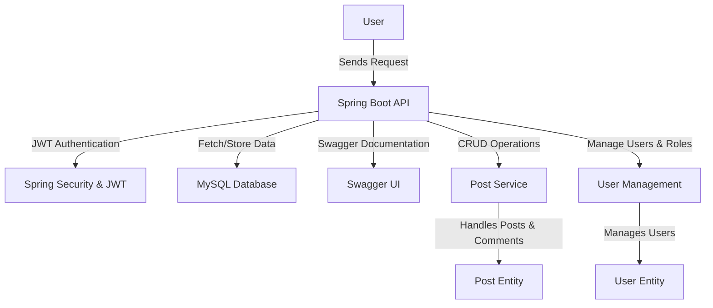

# Dynamic Blogging API

## 🚀 Overview
This project is a **high-performance RESTful API** built with **Spring Boot** for dynamic blogging, offering seamless **CRUD operations** for blog posts, categories, authentication, user management, and commenting. The API is secured with **JWT-based Spring Security** and leverages **MySQL with Hibernate and JPA** for optimal database performance. Additionally, **Swagger** is integrated for clear and interactive API documentation, making developer integration effortless.

## 🏗️ Tech Stack
- **Spring Boot** - Backend framework for RESTful APIs
- **Spring Security (JWT)** - Secure authentication and authorization
- **Hibernate & JPA** - ORM for efficient database management
- **MySQL** - Relational database for data persistence
- **Swagger** - API documentation and testing

## 🏛️ ER Diagram
The database schema follows a well-structured design, as shown below:


### 🔹 Database Entities:
- **User**: Stores user information (id, name, email, password, roles, etc.).
- **Role**: Defines different roles (Admin, User, etc.) for access control.
- **Post**: Represents blog posts with attributes like title, content, image, user reference, etc.
- **Category**: Groups blog posts into categories.
- **Comment**: Allows users to comment on posts.

## 📊 System Architecture
The following block diagram represents the system workflow and components:



## ✨ Features
✅ **User Authentication & Authorization** (JWT Secured)  
✅ **Role-Based Access Control** (Admin/User)  
✅ **CRUD Operations** for Posts, Categories, and Comments  
✅ **RESTful APIs with Modular Endpoints**  
✅ **MySQL Database Integration** with Hibernate & JPA  
✅ **Swagger UI** for API Documentation  
✅ **Secure Password Hashing**  
✅ **Efficient Data Handling & Pagination**  

## 📌 API Endpoints
| Endpoint | Method | Description |
|----------|--------|-------------|
| `/api/auth/register` | POST | Register a new user |
| `/api/auth/login` | POST | User authentication (JWT) |
| `/api/posts` | GET | Get all blog posts |
| `/api/posts/{id}` | GET | Get post by ID |
| `/api/posts` | POST | Create a new post (Auth Required) |
| `/api/posts/{id}` | PUT | Update a post (Auth Required) |
| `/api/posts/{id}` | DELETE | Delete a post (Auth Required) |
| `/api/categories` | GET | Fetch all categories |
| `/api/comments` | POST | Add a comment to a post |

_For a complete list of endpoints, refer to the **Swagger UI**._

## 🔐 Authentication & Security
- **JWT-based authentication** ensures secure access to API endpoints.
- **Role-based access control** restricts admin and user functionalities.
- **Spring Security** handles authentication and password encryption.

## 🎯 Getting Started
### Prerequisites
- Java 17+
- Maven 3+
- MySQL Database

### Installation & Running the Project
1. **Clone the repository**:
   ```bash
   git clone https://github.com/chirag21r/Dynamic-Blogging-API.git
   cd Dynamic-Blogging-API
   ```
2. **Configure MySQL Database** in `application.properties`:
   ```properties
   spring.datasource.url=jdbc:mysql://localhost:3306/blogging_db
   spring.datasource.username=root
   spring.datasource.password=your_password
   ```
3. **Build and run the project**:
   ```bash
   mvn spring-boot:run
   ```
4. **Access API Documentation** at:
   ```
   http://localhost:8080/swagger-ui/
   ```

## 📜 License
This project is open-source and available under the MIT License.

---
💡 _If you found this project helpful, don't forget to ⭐ the repo!_
